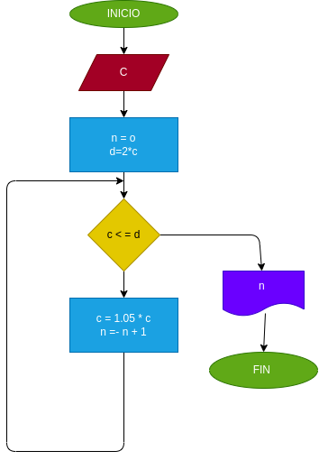

# interes_compuesto
hacer el diagrama de flujo y el programa en python , que lea un capital c , que averigue y imprima en cuantos meses se duplica si lo colocamos a un interes compuesto del 5% mensual

# ANALISIS

Variable de entrada 

c= capital inicial

n= nuero de meses

d= doble del capital inicial

variable de proceso

C : 1.05*C

n = n +1

Variables de salida

n : nos da los meses usados en este caso siempre es 15

C : el dinero ganado

# DISEÑO

# CONSTRUCCION